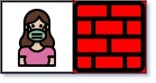

You are given an m x n matrix maze (0-indexed) with empty cells (represented as '.') and walls (represented as '+'). You are also given the entrance of the maze,  
where entrance = [entrancerow, entrancecol] denotes the row and column of the cell you are initially standing at.  
In one step, you can move one cell up, down, left, or right. You cannot step into a cell with a wall, and you cannot step outside the maze.  
Your goal is to find the nearest exit from the entrance. An exit is defined as an empty cell that is at the border of the maze. The entrance does not count as an exit.  
  
Return the number of steps in the shortest path from the entrance to the nearest exit, or -1 if no such path exists.  
  
Example 1:  
  
Input: maze = [["+","+",".","+"],[".",".",".","+"],["+","+","+","."]], entrance = [1,2]  
Output: 1  
Explanation: There are 3 exits in this maze at [1,0], [0,2], and [2,3].  
Initially, you are at the entrance cell [1,2].  
- You can reach [1,0] by moving 2 steps left.  
- You can reach [0,2] by moving 1 step up.  
It is impossible to reach [2,3] from the entrance.  
Thus, the nearest exit is [0,2], which is 1 step away.  
  
Example 2:  
  
Input: maze = [["+","+","+"],[".",".","."],["+","+","+"]], entrance = [1,0]  
Output: 2  
Explanation: There is 1 exit in this maze at [1,2].  
[1,0] does not count as an exit since it is the entrance cell.  
Initially, you are at the entrance cell [1,0].  
- You can reach [1,2] by moving 2 steps right.  
Thus, the nearest exit is [1,2], which is 2 steps away.  
  
Example 3:  
  
Input: maze = [[".","+"]], entrance = [0,0]  
Output: -1  
Explanation: There are no exits in this maze.  
  
Constraints:  
maze.length == m  
maze[i].length == n  
1 <= m, n <= 100  
maze[i][j] is either '.' or '+'.  
entrance.length == 2  
0 <= entrancerow < m  
0 <= entrancecol < n  
entrance will always be an empty cell.  
  
Code: Java  
  
```
class Solution {
    public int nearestExit(char[][] maze, int[] entrance) {
        int[][] dir = {{1,0},{0,1},{-1,0},{0,-1}};
        int n = maze.length, m = maze[0].length;
        Queue<int[]> queue = new LinkedList<>();
        queue.add(new int[]{entrance[0],entrance[1],0});
        maze[entrance[0]][entrance[1]] = '+';

        while(!queue.isEmpty()){
            int[] curr = queue.poll();
            for(int[] d: dir){
                int nr = d[0] + curr[0];
                int nc = d[1] + curr[1];

                if(nr >= 0 && nr < n && nc >= 0 && nc < m && maze[nr][nc] == '.'){
                    if(nr == 0 || nr == n-1 || nc == 0 || nc == m-1){
                        return curr[2] + 1;
                    }
                    maze[nr][nc] = '+';
                    queue.add(new int[]{nr,nc,curr[2]+1});
                }
            }
        }
        return -1;
    }
}
```

Time Complexity: O(m * n), m = number of rows, n = number of columns.  
Space Complexity: O(m * n), almost all cells can be in the queue → O(m × n).  
